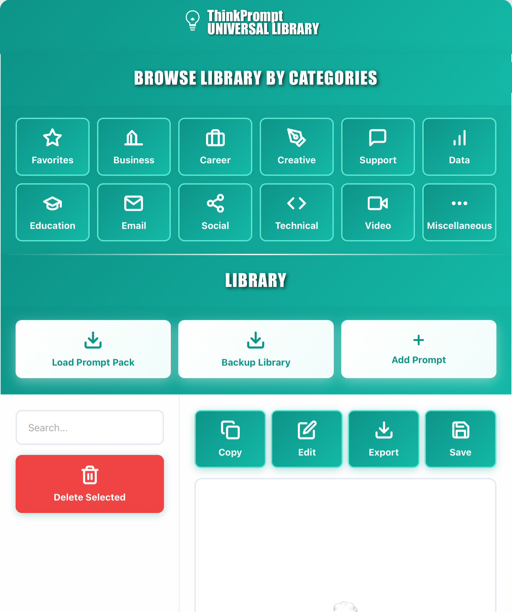

# ThinkPrompt - The Privacy-First Prompt Library

## 💡 Stop Searching. Start Working. ⏳

**ThinkPrompt** is a simple, browser-based prompt manager designed to solve the problem of **"Prompt Hoarding."**

Professionals spend valuable time creating or finding a **"killer" AI prompt** only to lose it in a screenshot folder, a saved newsletter, or an endless list of LinkedIn bookmarks. ThinkPrompt eliminates that friction by giving you **instant, organized, and private access** to your most efficient, time-saving inputs. Treat your refined prompts like the intellectual property they are.

## ✨ Key Features

ThinkPrompt is built on the philosophy of maximum efficiency and total privacy:

* **⚡ Frictionless Access:** Get to your most-used prompts in seconds. No more searching through chat history or fragmented files.
* **🔒 Privacy-First / Zero-Login:** All of your data (prompts) are saved **locally** in your browser's storage. Your prompts never leave your device.
* **📂 Simple Organization:** Categorize your prompts (Business, Creative, Technical, etc.) for quick retrieval.
* **💾 Local Backup & Restore:** Easily export your entire library as a JSON file for backup and version control.
* **🔄 Edit and Reuse:** Instantly load, edit, and copy any saved prompt with a single click to optimize your workflow.
* **📦 Prompt Pack Import:** Import prompt libraries shared by others or from your own backups.

## 🚀 Getting Started

Since ThinkPrompt is a single-file, browser-based application, you can use it immediately.

### Installation / Usage

1.  **Download:** Clone this repository or download the latest release of the **`thinkprompt.html`** file.
2.  **Open:** Double-click the `thinkprompt.html` file. It will open directly in your preferred web browser (Chrome, Firefox, Edge, Safari).
3.  **Start Saving:** Your prompt library will begin immediately, and all your data is automatically saved locally to your browser.

## 🛠️ Development & Documentation

This project was developed through a focused, conversational process using **Claude AI (Anthropic)**. It is currently maintained as a single, self-contained HTML file (HTML, CSS, and JavaScript) designed for simplicity and portability.

### Documents Used in Development

The following documents informed the development process, feature design, and messaging:

* `thinkprompt-launch (1).html` (Original launch page copy and feature breakdown)
* `thinkprompt-realestate (1).html` (Application code and prompt library structure)
* **[Placeholder for your planning/design documents - e.g., `DESIGN_NOTES.pdf`, `CONVERSATIONAL_LOG.txt`]**

We welcome feedback and bug reports to guide future development.

## 🤝 Contributing

While ThinkPrompt is currently a personal project, all feedback and suggestions are welcome. If you find a bug or have an idea for a feature, please open an issue in this repository.

## 📜 License

This project is licensed under the MIT License. See the [LICENSE](LICENSE) file for details.
